---
## Front matter
lang: ru-RU
title: Лабораторная работа №1
subtitle: Операционные системы
author:
  - Куокконен Дарина Андреевна, НКАбд-03-23
institute:
  - Российский университет дружбы народов, Москва, Россия
date: 19 февраля 2024

## i18n babel
babel-lang: russian
babel-otherlangs: english

## Formatting pdf
toc: false
toc-title: Содержание
slide_level: 2
aspectratio: 169
section-titles: true
theme: metropolis
header-includes:
 - \metroset{progressbar=frametitle,sectionpage=progressbar,numbering=fraction}
 - '\makeatletter'
 - '\beamer@ignorenonframefalse'
 - '\makeatother'

## font
mainfont: PT Serif
romanfont: PT Serif
sansfont: PT Sans
monofont: PT Mono
mainfontoptions: Ligatures=TeX
romanfontoptions: Ligatures=TeX
sansfontoptions: Ligatures=TeX,Scale=MatchLowercase
monofontoptions: Scale=MatchLowercase,Scale=0.9
---

## Цель работы

  Целью данной работы является приобретение практических навыков установки операционной системы на виртуальную машину, настройки минимально необходимых для дальнейшей работы сервисов.

## Задание

1. Создание виртуальной машины
2. Установка операционной системы
3. Работа с операционной системой после установки
4. Установка программного обеспечения для создания документации
5. Дополнительные задания

## Создание виртуальной машины

 В прошлом семестре я установила уже VirtualBox, и также создала виртуальную машину во время выполнения заданий, следовательно данный этап я пропускаю.

## Установка операционной системы

 По аналогичным причинам я пропускаю установку операционной системы.

## Работа с операционной системой после установки

- Вхожу в ОС под заданной мной при установке учетной записью
- Запускаю терминал
- Переключаюсь на роль супер-пользователя
- Обновляю все пакеты (рис. 1).

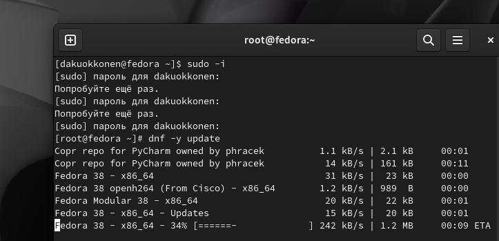{#fig:001 width=70%}

## Работа с операционной системой после установки

 Устанавливаю программы для удобства работы в консоли: tmux для открытия нескольких вкладок в одном терминале (рис. 2).

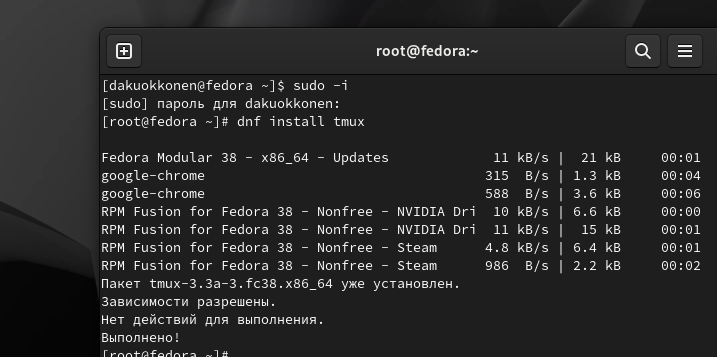{#fig:002 width=70%}

## Работа с операционной системой после установки

 Теперь я перемещаюсь в директорию /etc/selinux, открываю mс, и ищу нужный файл, для его изменения (рис. 3).

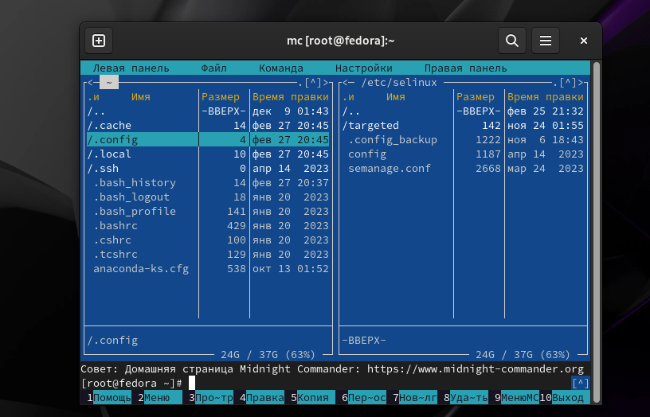{#fig:003 width=70%}

## Работа с операционной системой после установки

 Изменяю файл *config*: SELINUX=enforcing меняю на значение SELINUX=permissive (рис 4).
 Перезагружаю виртуальную машину *reboot*

## Работа с операционной системой после установки

 Снова вхожу в ОС, снова запускаю терминал, запускаю терминальный мультиплексор (рис ).

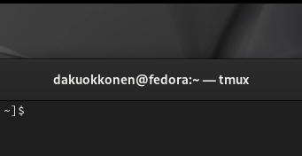{#fig:007 width=70%}

## Работа с операционной системой после установки

 Переключаюсь на роль супер-пользователя (рис. 8).

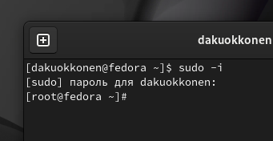{#fig:008 width=70%}

## Работа с операционной системой после установки

 Устанавливаю пакет DevelopmentTools (рис. 9).

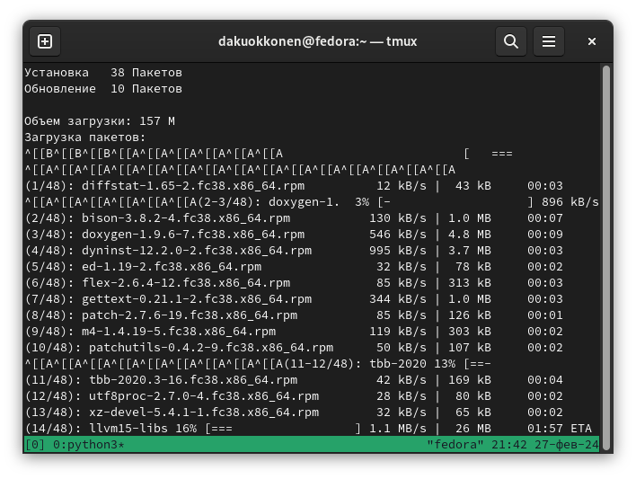{#fig:009 width=70%}

## Работа с операционной системой после установки

 Устанавливаю пакет *dkms* (рис. 10).

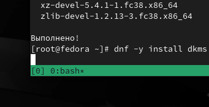{#fig:010 width=70%}

## Работа с операционной системой после установки

 - В меню виртуальной машины, я подключаю образ диска гостевой ОС 
 - Примонтирую диск с помощью утилиты *mount*
 - Устанавливаю драйвера (рис. 11).

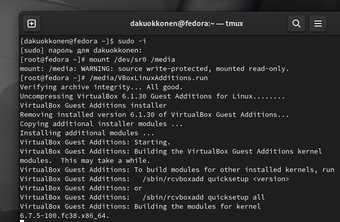{#fig:011 width=70%}

## Установка программного обеспечения для создания документации

 Запускаю терминал. Запускаю терминальный мультиплексор tmux, переключаюсь на роль супер-пользователя. Устанавливаю pandoc с помощью утилиты *dnf* (рис. 12).

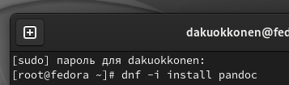{#fig:012 width=70%}

## Установка программного обеспечения для создания документации

 Устанавливаю дистрибутив *texlive* (рис. 13).

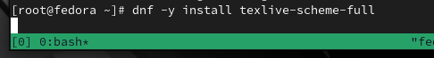{#fig:013 width=70%}

## Выводы

При выполнении данной лабораторной работы я приобрела практические навыки установки операционной системы на виртуальную машину, а так же сделала настройки минимально необходимых для дальнейшей работы сервисов.

## Выполнение дополнительного задания

 Я ввожу в терминале команду *dmesg*, чтобы проанализировать последовательность загрузки системы (рис. 14).

{#fig:014 width=70%}

## Выполнение дополнительного задания

 С помощью поиска, осуществляемого командой 'dmesg | grep -i <что ищем>', ищу версию ядра Linux (рис. 15).

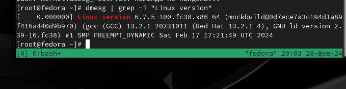{#fig:015 width=70%}

## Выполнение дополнительного задания

 Если вводить "Detected Mhz processor", то мне ничего не выведется. Это происходит потому, что запрос не предусматривает дополнительные символы внутри него. В таком случае оставляем одно из ключевых слов и получаем результат (рис. 16).

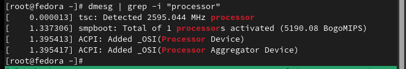{#fig:016 width=70%}

## Выполнение дополнительного задания

 Аналогично ищу модель процессора (рис. 17).

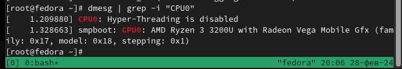{#fig:017 width=70%}

## Выполнение дополнительного задания

 Объем доступной оперативной памяти ищу аналогично поиску частоты процессора, т. к. возникла та же проблема, что и там (рис. 18).

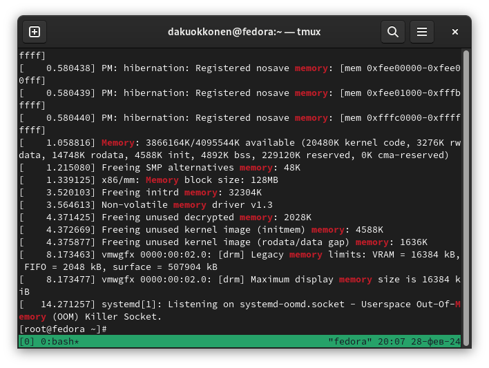{#fig:018 width=70%}

## Выполнение дополнительного задания

 Далее, я нахожу тип обнаруженного гипервизора (рис. 19).

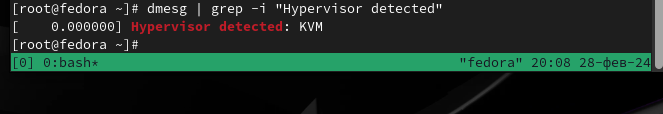{#fig:019 width=70%}

## Выполнение дополнительного задания

 Тип файловой системы корневого раздела можно посомтреть с помощью утилиты *fdisk* (рис. 20).

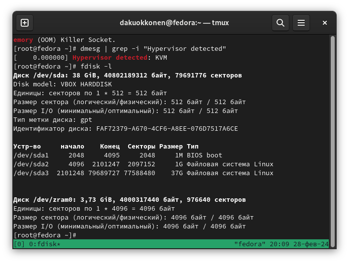{#fig:020 width=70%}

## Выполнение дополнительного задания

 Последовательность монтирования файловых систем можно посмотреть, введя в поиск по результату *dmesg* слово *mount* (рис. 21).

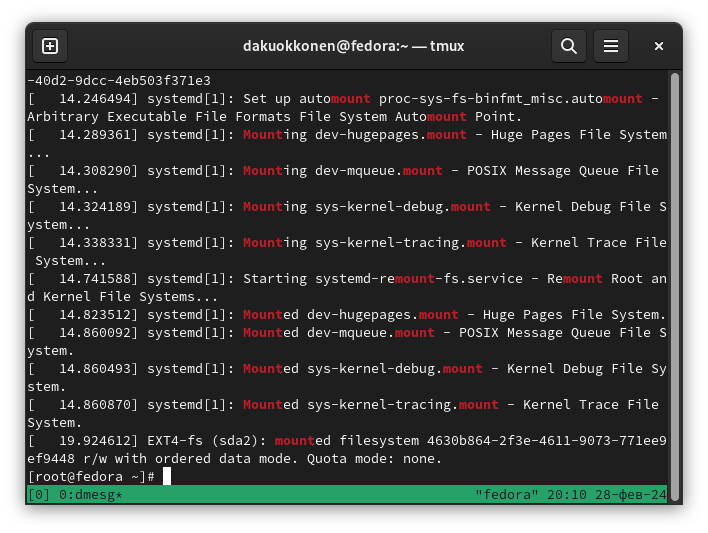{#fig:021 width=70%}

## Список литературы{.unnumbered}

::: {#refs}
1. Dash P. Getting started with oracle vm virtualbox. Packt Publishing Ltd, 2013. 86 p.
2. Colvin H. Virtualbox: An ultimate guide book on virtualization with virtualbox. CreateSpace Independent Publishing Platform, 2015. 70 p.
3. van Vugt S. Red hat rhcsa/rhce 7 cert guide : Red hat enterprise linux 7 (ex200 and ex300). Pearson IT Certification, 2016. 1008 p.
4. Робачевский А., Немнюгин С., Стесик О. Операционная система unix. 2-е изд. Санкт-Петербург: БХВ-Петербург, 2010. 656 p.
5. Немет Э. et al. Unix и Linux: руководство системного администратора. 4-е изд. Вильямс, 2014. 1312 p.
6. Колисниченко Д.Н. Самоучитель системного администратора Linux. СПб.: БХВ-Петербург, 2011. 544 p.
7. Robbins A. Bash pocket reference. O’Reilly Media, 2016. 156 p.

:::
