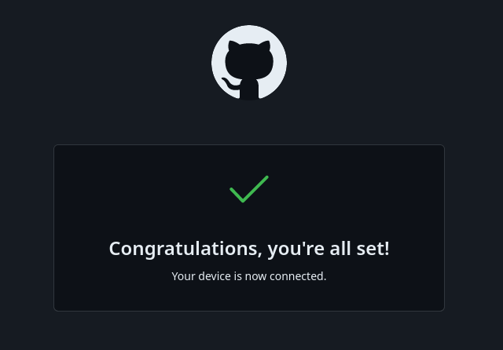

---
## Front matter
lang: ru-RU
title: Лабораторная работа №2
subtitle: Операционные системы
author:
  - Куокконен Д. А.
institute:
  - Российский университет дружбы народов, Москва, Россия
date: 19 февраля 2024

## i18n babel
babel-lang: russian
babel-otherlangs: english

## Formatting pdf
toc: false
toc-title: Содержание
slide_level: 2
aspectratio: 169
section-titles: true
theme: metropolis
header-includes:
 - \metroset{progressbar=frametitle,sectionpage=progressbar,numbering=fraction}
 - '\makeatletter'
 - '\beamer@ignorenonframefalse'
 - '\makeatother'
---

## Цель работы

Цель данной лабораторной работы -- изучение идеологии и применения средств контроля версий, освоение умения по работе с git.

## Задание

1. Создать базовую конфигурацию для работы с git
2. Создать ключ SSH
3. Создать ключ GPG
4. Настроить подписи Git
5. Заргеистрироваться на GitHub
6. Создать локальный каталог для выполнения заданий по предмету.

## Выполнение лабораторной работы. Установка ПО.

  Я устанавливаю необходимое программное обеспечение *git* и *gh* через терминал с помощью команд: *dnf install git* и *dnf install gh* (рис. 1).

{#fig:001 width=70%}

## Выполнение лабораторной работы. Базовая настройка git

  Задаю в качестве имени и email владельца репозитория свои имя, фамилию и электронную почту, настраиваю *utf-8* в выводе сообщений *git* для их корректного отображения, задаю имя начальной ветке, задаю параметры *autocrlf* и *safecrlf* для корректного отображения конца строки  (рис. 2).

{#fig:002 width=70%}

## Выполнение лабораторной работы. Создание ключа SSH

  Создаю ключ ssh размером 4096 бит по алгоритму rsa (рис. 3).

{#fig:003 width=70%}

## Выполнение лабораторной работы. Создание ключа SSH

  Создаю ключ ssh по алгоритму ed25519 (рис. 4).

{#fig:004 width=70%}

## Выполнение лабораторной работы. Создание ключа GPG

 Генерирую ключ *GPG*, затем выбираю тип ключа *RSA*, задаю максиммальную длину ключа: 4096, выбираю неограниченный срок действия ключа. Завершаем настройку (рис. 5).

{#fig:005 width=70%}

## Выполнение лабораторной работы. Регистрация на Github

 Раннее у меня уже был создан аккаунт на Github, поэтому я просто вхожу в свой аккаунт.

## Выполнение лабораторной работы. Добавление ключа GPG в Github

- Вывожу список созданных ключей в терминал
- Ищу в результате запроса отпечаток ключа
- Копирую его в буфер обмена, за это отвечает утилита *xclip*  (рис. 6).

{#fig:006 width=70%}

## Выполнение лабораторной работы. Настроить подписи Git

  Настраиваю автоматические подписи коммитов *git* (рис.7).

{#fig:007 width=70%}

## Выполнение лабораторной работы. Настройка gh

- Начинаю авторизацию в gh
- отвечаю на наводящие вопросы от утилиты
- выбираю авторизоваться через браузер (рис. 8).

{#fig:008 width=70%}

## Выполнение лабораторной работы. Настройка gh

 Завершаю авторизацию на сайте (рис. 9).

{#fig:009 width=70%}

## Выполнение лабораторной работы. Настройка gh

 Вижу сообщение о завершении авторизации (рис. 10).

{#fig:010 width=70%}

## Выполнение лабораторной работы. Создание репозитория курса на основе шаблона

- Создаю директорию с помощью утилиты mkdir и флага -p
- Перехожу в только что созданную директорию "ОС".
- В терминале ввожу команду gh repo create study_2023-204_os-intro --template yamadharma/course-directory-student-trmplate --public.
- После этого клонирую репозиторий к себе в директорию (рис. 11). 

{#fig:011 width=70%}

## Выполнение лабораторной работы. Создание репозитория курса на основе шаблона

 Ввожу фразу-пароль, установленную ранее (рис. 12).

{#fig:012 width=70%}

## Выполнение лабораторной работы. Создание репозитория курса на основе шаблона

 Перехожу в каталог курса с помощью утилиты cd, там я удаляю лишние файлы с помощью утилиты rm, далее создаю необходимые каталоги используя make. В конце концов добавляю все новые файлы для отправки на сервер (сохраняю добавленные изменения) с помощью команды git add и комментирую их с помощью git commit (рис. 13).

{#fig:013 width=70%}

## Выполнение лабораторной работы. Создание репозитория курса на основе шаблона

 Отправляю файлы на сервер с помощью *git push* (рис. 014).

{#fig:014 width=70%}

## Выводы

При выполнении данной лабораторной работы я изучила идеологию и применение средств контроля версий, освоила умение по работе с git.

## Список литературы{.unnumbered}

::: {#refs}
1. Лабораторная работа № 2 [Электронный ресурс] URL: https://esystem.rudn.ru/mod/page/view.php?id=970819
:::
