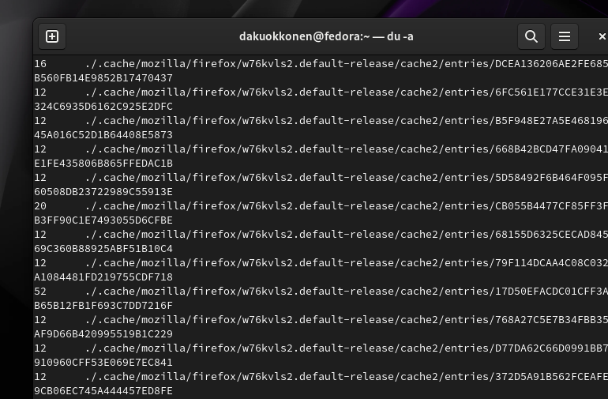

---
## Front matter
title: "Отчёт по лабораторной работе №8"
subtitle: "Дисциплина: Операционные системы"
author: "Дарина Андреевна Куокконен"

## Generic otions
lang: ru-RU
toc-title: "Содержание"

## Bibliography
bibliography: bib/cite.bib
csl: pandoc/csl/gost-r-7-0-5-2008-numeric.csl

## Pdf output format
toc: true # Table of contents
toc-depth: 2
lof: true # List of figures

fontsize: 12pt
linestretch: 1.5
papersize: a4
documentclass: scrreprt
## I18n polyglossia
polyglossia-lang:
  name: russian
  options:
	- spelling=modern
	- babelshorthands=true
polyglossia-otherlangs:
  name: english
## I18n babel
babel-lang: russian
babel-otherlangs: english
## Fonts
mainfont: PT Serif
romanfont: PT Serif
sansfont: PT Sans
monofont: PT Mono
mainfontoptions: Ligatures=TeX
romanfontoptions: Ligatures=TeX
sansfontoptions: Ligatures=TeX,Scale=MatchLowercase
monofontoptions: Scale=MatchLowercase,Scale=0.9
## Biblatex
biblatex: true
biblio-style: "gost-numeric"
biblatexoptions:
  - parentracker=true
  - backend=biber
  - hyperref=auto
  - language=auto
  - autolang=other*
  - citestyle=gost-numeric
## Pandoc-crossref LaTeX customization
figureTitle: "Рис."
tableTitle: "Таблица"
listingTitle: "Листинг"
lofTitle: "Список иллюстраций"

lolTitle: "Листинги"
## Misc options
indent: true
header-includes:
  - \usepackage{indentfirst}
  - \usepackage{float} # keep figures where there are in the text
  - \floatplacement{figure}{H} # keep figures where there are in the text
---

# Цель работы

 Цель данной лабораторной работы - ознакомление с инструментами поиска файлов и фильтрации текстовых данных. Приобретение практических навыков: по управлению процессами (и заданиями), по проверке использования диска и обслуживанию файловых систем.

# Задание 

1. Осуществить вход в систему, используя соответствующее имя пользователя.
2. Записать в файл file.txt названия файлов, содержащихся в каталоге /etc
3. Выведите имена всех файлов из file.txt, имеющих расширение .conf
4. Запустите в фоновом режиме процесс, который будет записывать в файл ~/logfile файлы, имена которых начинаются с log.
5. Удалить лишние файлы
6. Выполнить команды df и du
7. Ответы на контрольные вопросы

# Теоретическое введение 

 В системе по умолчанию открыто три специальных потока:
– stdin — стандартный поток ввода (по умолчанию: клавиатура), файловый дескриптор
0;
– stdout — стандартный поток вывода (по умолчанию: консоль), файловый дескриптор
1;
– stderr — стандартный поток вывод сообщений об ошибках (по умолчанию: консоль),
файловый дескриптор 2.
 Большинство используемых в консоли команд и программ записывают результаты
своей работы в стандартный поток вывода stdout. Например, команда ls выводит в стан-
дартный поток вывода (консоль) список файлов в текущей директории. Потоки вывода
и ввода можно перенаправлять на другие файлы или устройства. Проще всего это делается
с помощью символов >, >>, <, <<. 
 Конвейер (pipe) служит для объединения простых команд или утилит в цепочки, в ко-
торых результат работы предыдущей команды передаётся последующей. Синтаксис
следующий: *команда 1 | команда 2* - означает, что вывод команды 1 передастся на ввод команде 2
 Конвейеры можно группировать в цепочки и выводить с помощью перенаправления в файл, например:  *ls -la |sort > sortilg_list* вывод команды ls -la передаётся команде сортировки sort\verb, 
 которая пишет результат в файл sorting_list\verb. 
 Чаще всего скрипты на Bash используются в качестве автоматизации каких-то рутинных операций в консоли, отсюда иногда возникает необходимость в обработке stdout одной команды и передача на stdin другой команде, при этом результат выполнения команды должен обработан. 

# Выполнение лабораторной работы

Вхожу в систему,используя соответствующее имя пользователя. С помощью перенапраления ">" добавляю в файл file.txt название файлов из /etc. (рис. 1).

{#fig:001 width=70%}

С помощью команды head проверяю первые 10 строк файла (рис. 2).

{#fig:002 width=70%}

Добавляю в файл имена из домашнего каталога(рис. 3).

{#fig:003 width=70%}

Вывожу на экран имена всех файлов,содержащих расщирение .conf, с помощию команды grep (рис. 4).

{#fig:004 width=70%}

Записываю найденные файлы в новый файл (рис. 5).

{#fig:005 width=70%}

Нахожу в домашнем каталоге все файлы,которые начинаются на "c" (рис. 6). 

{#fig:006 width=70%}

Еще один способ найти элементы с первым символов. Однако этот способ не работает для поиска файлов из подкаталогов (рис. 7).

{#fig:007 width=70%}

С помощью опции find, вывожу на экран имена файлов из каталог /etc,начинающихся с символа h  (рис. 8).

{#fig:008 width=70%}

Запускаю в фоновом режиме процесс, который будет записывать в файл ~/logfile файлы, имена которых начинаются с log. (рис. 9).

{#fig:09 width=70%}

Проверяю,что файл создан и удаляю его (рис. 10).

{#fig:010 width=70%}

Запускаю в фоновом режиме редактор mousepad (рис. 11).

{#fig:011 width=70%}

Определяю идентификатор процесса mousepad, используя команду ps, конвейер и фильтр grep. (рис. 12).

{#fig:012 width=70%}

Удаляю процесс (рис. 13). 

{#fig:013 width=70%}

Изучаю справку команды df и выполняю её,использовав утилиту -iv, которая позволяет увидеть информацию об инодах и сделать вывод читаемым.игнорирую сообщение системы о нем,так мы узнаем,сколько у нашей системы места (рис. 14).

{#fig:014 width=70%}

Изучаю справку команды du и выполняю её,использовав утилиту -а,которая позволяет увидеть,сколько памяти занимают все файлы (рис. 15).

{#fig:015 width=70%}

Выполняю команду du (рис. 16).

{#fig:016 width=70%}

# Выводы
 Я ознакомилась с инструментами поиска файлов и фильтрации текстовых данных,приобрела практические навыки: по управлению процессами (и заданиями), попроверке использования диска и обслуживанию файловых систем.

# Ответы на контрольные вопросы

 1. Какие потоки ввода вывода вы знаете? В системе по умолчанию открыто три специальных потока: – stdin — стандартный поток ввода (по умолчанию: клавиатура), файловый дескриптор 0; – stdout — стандартный поток вывода (по умолчанию: консоль), файловый дескриптор 1; – stderr — стандартный поток вывод сообщений об ошибках (по умолчанию: консоль), файловый дескриптор 2.

 2. Объясните разницу между операцией > и ». Этот знак > - перенаправление ввода/вывода, а » - перенаправление в режиме добавления.

 3. Что такое конвейер? Конвейер (pipe) служит для объединения простых команд или утилит в цепочки, в которых результат работы предыдущей команды передаётся последующей.

 4. Что такое процесс? Чем это понятие отличается от программы? Главное отличие между программой и процессом заключается в том, что программа - это набор инструкций, который позволяет ЦПУ выполнять определенную задачу, в то время как процесс - это исполняемая программа.

 5. Что такое PID и GID? PPID - (parent process ID) идентификатор родительского процесса. Процесс может порождать и другие процессы. UID, GID - реальные идентификаторы пользователя и его группы, запустившего данный процесс.

 6. Что такое задачи и какая команда позволяет ими управлять? Запущенные фоном программы называются задачами (jobs). Ими можно управлять с помощью команды jobs, которая выводит список запущенных в данный момент задач.

 7. Найдите информацию об утилитах top и htop. Каковы их функции? Команда htop похожа на команду top по выполняемой функции: они обе показывают информацию о процессах в реальном времени, выводят данные о потреблении системных ресурсов и позволяют искать, останавливать и управлять процессами.

 У обеих команд есть свои преимущества. Например, в программе htop реализован очень удобный поиск по процессам, а также их фильтрация. В команде top это не так удобно — нужно знать кнопку для вывода функции поиска.

 Зато в top можно разделять область окна и выводить информацию о процессах в соответствии с разными настройками. В целом top намного более гибкая в настройке отображения процессов.

 8. Назовите и дайте характеристику команде поиска файлов. Приведите примеры использования этой команды.

 Команда find - это одна из наиболее важных и часто используемых утилит системы Linux. Это команда для поиска файлов и каталогов на основе специальных условий. Ее можно использовать в различных обстоятельствах, например, для поиска файлов по разрешениям, владельцам, группам, типу, размеру и другим подобным критериям.

 Утилита find предустановлена по умолчанию во всех Linux дистрибутивах, поэтому вам не нужно будет устанавливать никаких дополнительных пакетов. Это очень важная находка для тех, кто хочет использовать командную строку наиболее эффективно.

 Команда find имеет такой синтаксис: find [папка] [параметры] критерий шаблон [действие] Пример: find /etc -name "p*" -print

 9. Можно ли по контексту (содержанию) найти файл? Если да, то как? find / -type f -exec grep -H 'текстДляПоиска' {} ;

 10. Как определить объем свободной памяти на жёстком диске? С помощью команды df -h.

 11. Как определить объем вашего домашнего каталога? С помощью команды du -s.

 12. Как удалить зависший процесс? С помощью команды kill% номер задачи.

# Список литературы{.unnumbered}

 [Архитектура ЭВМ](https://esystem.rudn.ru/pluginfile.php/2288087/mod_resource/content/4/005-lab_files.pdf) 
