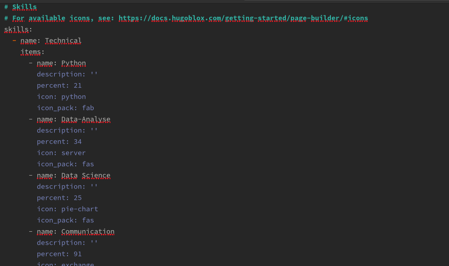
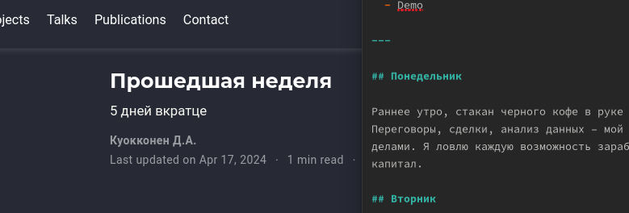
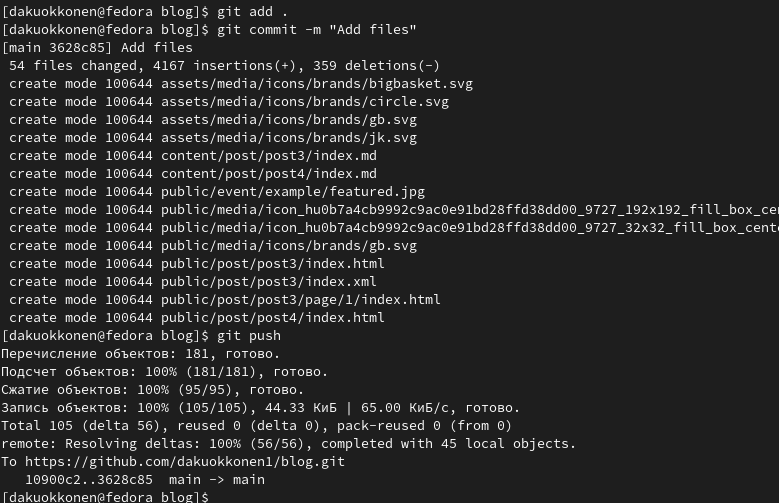

---
## Front matter
lang: ru-RU
title: Этап индивидуального проекта №3
subtitle: Операционные системы
author:
  - Куокконен Дарина Андреевна, НКАбд-03-23
institute:
  - Российский университет дружбы народов, Москва, Россия

date: 06 марта 2024

## i18n babel
babel-lang: russian
babel-otherlangs: english

## Formatting pdf
toc: false
toc-title: Содержание
slide_level: 2
aspectratio: 169
section-titles: true
theme: metropolis
header-includes:
 - \metroset{progressbar=frametitle,sectionpage=progressbar,numbering=fraction}
 - '\makeatletter'
 - '\beamer@ignorenonframefalse'
 - '\makeatother'
 
## font
mainfont: PT Serif
romanfont: PT Serif
sansfont: PT Sans
monofont: PT Mono
mainfontoptions: Ligatures=TeX
romanfontoptions: Ligatures=TeX
sansfontoptions: Ligatures=TeX,Scale=MatchLowercase
monofontoptions: Scale=MatchLowercase,Scale=0.9
---

## Цель работы

 Продолжить работу с сайтом, теперь нужно добавить личную информацию, пару постов.

## Задание

 1. Добавить информацию о навыках (Skills).
 2. Добавить информацию об опыте (Experience).
 3. Добавить информацию о достижениях (Accomplishments).
 4. Сделать пост по прошедшей неделе.
 5. Добавить пост на тему по выбору.

## Выполнение проекта

 Захожу в терминал, перехожу в директорию ~/work/blog, ввожу команду ~/bin/hugo server для запуска локального сервера

## Выполнение проекта

  - Перехожу в директорию ~/work/blog/content/authors/admin
  - Открываю файл _index.md, его я буду редактировать далее
  - В разделе "Skills" прописываю свои навыки
  - Иконки поставила, найдя в интернете официальную библиотеку fas
  
{#fig:002 width=70%}

## Выполнение проекта

 Изменяю раздел с моими увлечениями (рис. 3)

{#fig:003 width=70%}

## Выполнение проекта

 Проверяю, есть ли изменения на сайте (рис. 4)

{#fig:004 width=70%}

## Выполнение проекта

 Далее добавляю свой опыт в блоке Experience, указав название компании, в которой получил опыт работы, добавил даты, поменял иконки (рис. 5)

{#fig:005 width=70%}

## Выполнение проекта

 Чтобы корректно отображались иконки компаний, нужно скачать изображения из интернета в формате svg и перенести в необходимую директорию (рис. 6)

{#fig:006 width=70%}

## Выполнение проекта

 Добавила пост на тему по выбору - легкословесные языки разметки, изменив файл index в соответствующей папке (рис. 7)

{#fig:007 width=70%}

## Выполнение проекта

 Добавил пост по прошедшим 5 дням в той же папке (рис. 8)

{#fig:008 width=70%}

## Выполнение проекта

 Закрываю локальный сервер с помощью клавиш Ctrl+C и собираю сайт с изменениями, введя команду ~/bin/hugo без аргументов (рис. 9)

{#fig:009 width=70%}

## Выполнение проекта

 Отправляю изменения на GitHub (рис. 10)

{#fig:010 width=70%}

## Выводы

 В процессе выполнения второго этапа индивидуального проекта я научилась редактировать личные данные, написала несколько постов и добавил все изменения на сайт.
 
